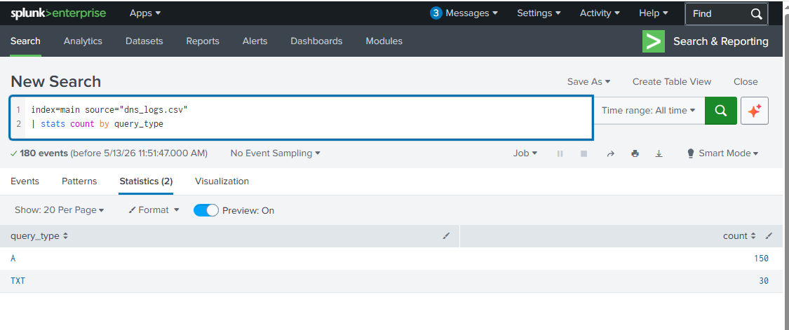
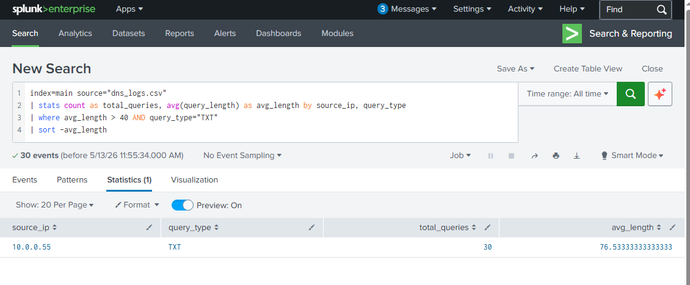
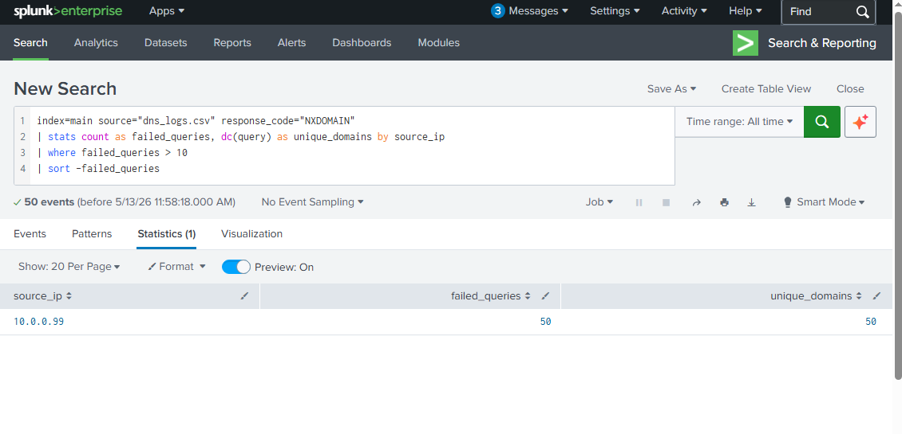
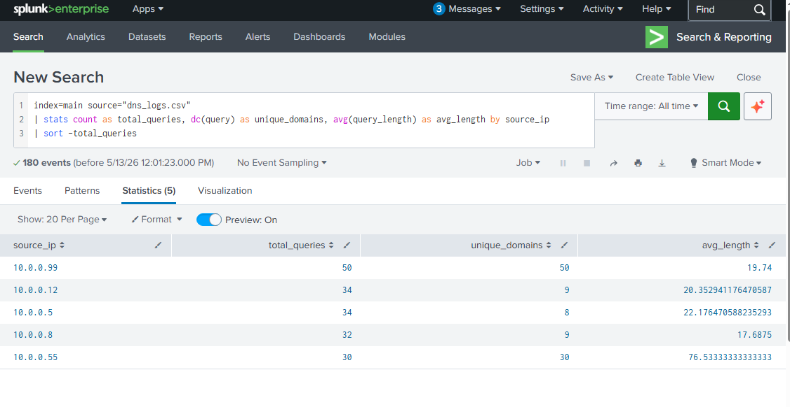
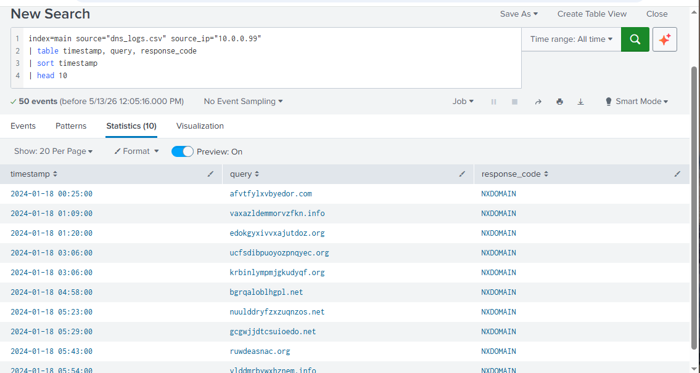

# 🌐 DNS Analysis & Threat Detection Using Splunk
## Detecting DNS Tunneling and DGA Malware Activity

---

## 📌 Problem
DNS is one of the most abused protocols in cybersecurity.
Because firewalls rarely block DNS traffic, attackers 
exploit it to hide malicious activity including data 
exfiltration and malware communication. This project 
analyzes DNS logs to detect two critical threats:
DNS Tunneling and Domain Generation Algorithm (DGA) malware.

---

## 🎯 Objectives
- Simulate realistic DNS logs including normal and
  malicious traffic patterns
- Detect DNS tunneling using query length analysis
- Identify DGA malware using NXDOMAIN failure patterns
- Compare normal vs suspicious IP behaviour

---

## 🛠️ Tools Used
| Tool | Purpose |
|---|---|
| **Splunk** | SIEM platform for log analysis |
| **Python** | DNS log simulation |
| **SPL** | Splunk search language |
| **DNS Logs** | Network protocol event data |

---

## 🧠 Attack Background

### What is DNS?
DNS (Domain Name System) translates human-readable
domain names like google.com into IP addresses.
Every internet connection starts with a DNS query.

### Why Attackers Abuse DNS
DNS is almost never blocked by firewalls because
organizations need it to function. Attackers exploit
this trust to hide malicious traffic inside normal
looking DNS queries.

### DNS Tunneling
Attackers hide stolen data inside DNS queries:
- Uses TXT record type to carry large payloads
- Queries are unusually long (50-100+ characters)
- Traffic looks like normal DNS to firewalls

### Domain Generation Algorithm (DGA)
Malware generates random domain names to find
attacker-controlled servers:
- Generates hundreds of random domains daily
- Most return NXDOMAIN (domain doesn't exist)
- When attacker registers one — malware connects

---

## 🗃️ Dataset
Simulated DNS logs with 180 records:

| Category | Count | Description |
|---|---|---|
| Normal Traffic | 100 | Legitimate DNS queries |
| DGA Malware | 50 | Random domains — NXDOMAIN responses |
| DNS Tunneling | 30 | Unusually long TXT queries |

**Log Fields:**
- `timestamp` — When query occurred
- `source_ip` — Machine making the query
- `query` — Domain name queried
- `query_type` — A (normal) or TXT (suspicious)
- `response_code` — NOERROR or NXDOMAIN
- `query_length` — Length of domain queried
- `response_length` — Size of DNS response

---

## 🔎 Detection Queries (SPL)

### Query 1 — DNS Query Types Distribution
index=main source="dns_logs.csv"
| stats count by query_type
Shows distribution of A vs TXT records.
High TXT count indicates possible tunneling.

### Query 2 — Detect DNS Tunneling
index=main source="dns_logs.csv"
| stats count as total_queries,
avg(query_length) as avg_length
by source_ip, query_type
| where avg_length > 40 AND query_type="TXT"
| sort -avg_length
Flags IPs with unusually long TXT queries —
key indicator of DNS tunneling activity.

### Query 3 — Detect DGA Malware
index=main source="dns_logs.csv"
response_code="NXDOMAIN"
| stats count as failed_queries,
dc(query) as unique_domains
by source_ip
| where failed_queries > 10
| sort -failed_queries
Identifies IPs making many failed queries to
unique domains — classic DGA malware behaviour.

### Query 4 — Full IP Behaviour Comparison
index=main source="dns_logs.csv"
| stats count as total_queries,
dc(query) as unique_domains,
avg(query_length) as avg_length
by source_ip
| sort -total_queries
Compares all IPs side by side to identify
anomalous behaviour patterns.

### Query 5 — Sample DGA Domains
index=main source="dns_logs.csv"
source_ip="10.0.0.99"
| table timestamp, query, response_code
| sort timestamp
| head 10
Shows actual DGA domain names generated
by the infected machine.

---

## 📸 Results

### Query 1 — DNS Query Types

### Query 2 — DNS Tunneling Detected

### Query 3 — DGA Malware Detected

### Query 4 — IP Behaviour Comparison

### Query 5 — Sample DGA Domains

---

## 🧠 Analysis

### Finding 1 — DNS Tunneling Confirmed
IP 10.0.0.55 made 30 TXT record queries with
an average length of 76.5 characters. Normal
DNS queries average 10-30 characters. This
extreme length indicates data being exfiltrated
through DNS queries.

### Finding 2 — DGA Malware Confirmed
IP 10.0.0.99 made 50 queries to 50 completely
unique random domains — all returning NXDOMAIN.
Sample domains detected:

| Domain | Response |
|---|---|
| afvtfylxvbyedor.com | NXDOMAIN |
| vaxazldemmorvzfkn.info | NXDOMAIN |
| edokgyxivvxajstdoz.org | NXDOMAIN |
| ucfsdibpuoyozpnqyec.org | NXDOMAIN |

No human generates domains like these — this
is 100% automated malware behaviour.

### Finding 3 — Normal IPs Identified
IPs 10.0.0.5, 10.0.0.8 and 10.0.0.12 showed
normal behaviour — querying 8-9 unique known
domains with average lengths of 17-22 characters.

### Finding 4 — Protocol Abuse
Both attacks exploited DNS because:
- DNS is rarely blocked by firewalls
- Looks like legitimate network traffic
- Hard to detect without query length analysis

---

## ⚠️ DNS Attack Comparison

| Attack | Indicator | Detection Method |
|---|---|---|
| **DNS Tunneling** | Long TXT queries (50-100+ chars) | avg(query_length) > 40 |
| **DGA Malware** | Many NXDOMAIN failures | dc(query) with NXDOMAIN filter |
| **Normal Traffic** | Short A queries to known domains | Baseline comparison |

---

## ✅ Conclusion & Recommendations

### Immediate Actions
| Priority | Action |
|---|---|
| 1 | 🚫 Block 10.0.0.55 — DNS tunneling confirmed |
| 2 | 🔒 Isolate 10.0.0.99 — DGA malware infected |
| 3 | 🔍 Investigate what data was exfiltrated |
| 4 | 🧹 Run malware scan on 10.0.0.99 |
| 5 | 📢 Escalate to Tier 2 for forensic investigation |

### Preventive Recommendations
| Recommendation | Purpose |
|---|---|
| DNS query length monitoring | Flag unusually long queries |
| NXDOMAIN rate limiting | Detect DGA behaviour early |
| DNS filtering solution | Block known malicious domains |
| Real-time Splunk alerts | Immediate notification of anomalies |
| Network segmentation | Limit infected machine communication |

---

## 🔗 Related Projects
- [Brute Force Detection](https://github.com/Phredreeq/brute-force-detection)
- [Password Spray Detection](https://github.com/Phredreeq/password-spray-detection)
- [Firewall Log Analysis](https://github.com/Phredreeq/firewall-log-analysis)
- [Network Traffic Analysis](https://github.com/Phredreeq/network-traffic-analysis-wireshark)

---

## 👤 Author
Fredrick Agufenwa

Cybersecurity Student | SOC & Threat Detection
